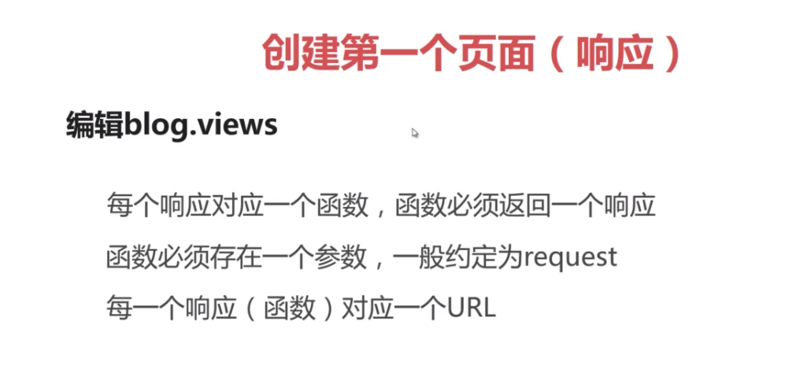
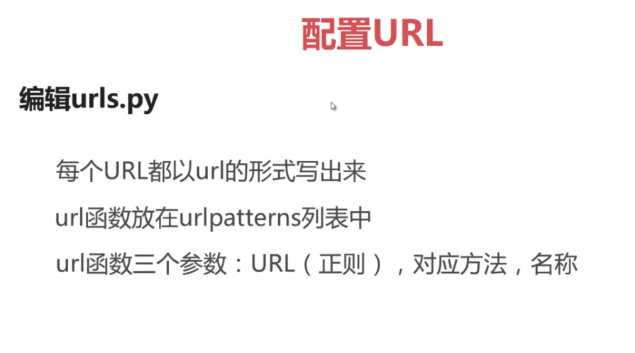
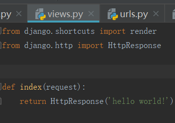
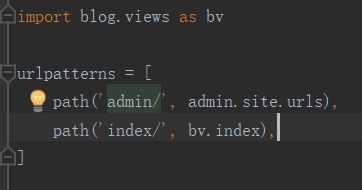

# Django项目
## 1. 创建项目
cmd到达工作目录 cd /d d:\python work\learning_log 
进入虚拟环境 ll_env\scripts\activate 
创建项目 django-admin.py startproject 项目名称 
## 2. 创建应用
python manage.py startapp 应用名称 
将应用名称添加到settings.py de INSTALLED_APPS中 
## 3. 创建第一个页面

## 4. 配置urls

