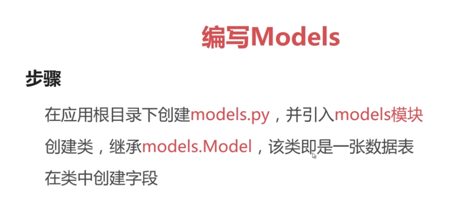
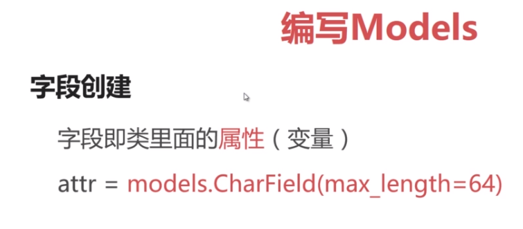
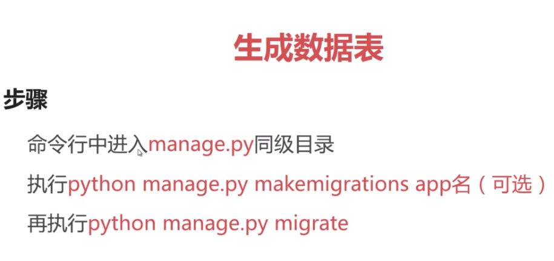
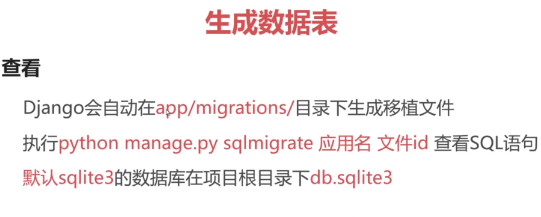
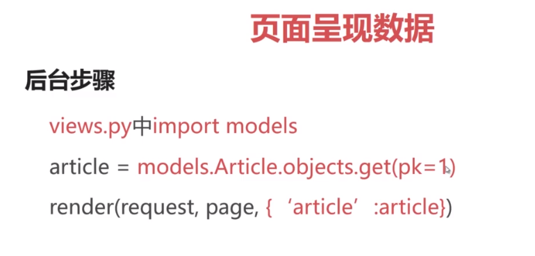
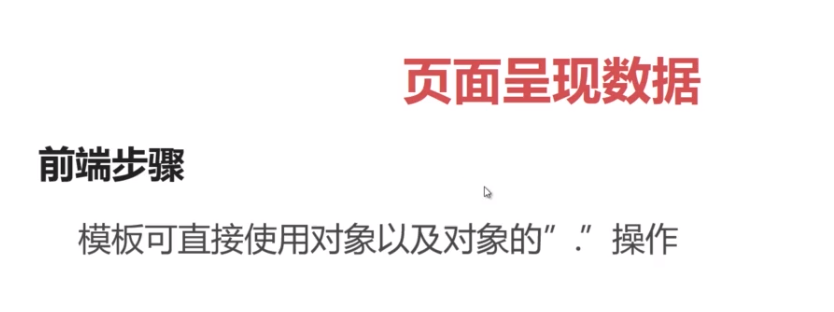
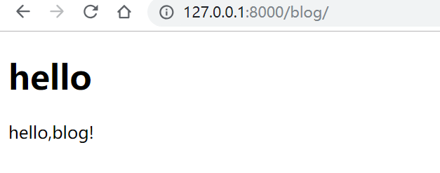
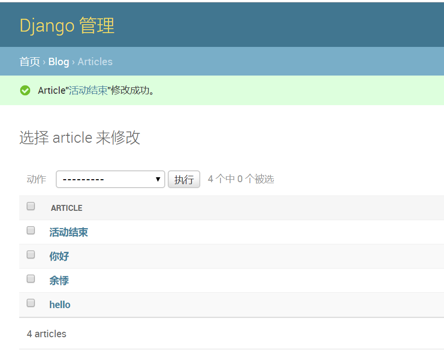
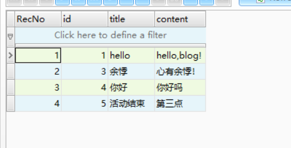

# 1. django项目实现
### URL配置，view视图，templates模板（html页面），models模块（数据库）

```python
from __future__ import unicode_literals
from django.db import models


class Article(models.Model):
    title = models.CharField(max_length=32, default='Title')
    content = models.TextField(null=True)
```




```python
from django.shortcuts import render
from . import models


def index(request):
    article = models.Article.objects.get(pk=1)
    return render(request, 'blog/index.html', {'article': article})
```

```html
<h1>{{ article.title }}</h1>
<p>{{ article.content }}</p>
```
运行成功！



# 2. admin超级用户
## 2.1 创建超级用户admin
工作目录下输入： python manage.py createsuperuser</br>
用户名：yuji
密码：liuwenjun
## 2.2 将django的admin页面改为中文
在settings.py中设为LANGUAGE_CODE = 'zh_Hans'
## 2.3 配置admin
注册模板：admin.py中
admin.site.register(模型名称)
```python
from blog.models import Article

admin.site.register(Article)

```
## 2.4 admin总结
admin超级用户的作用，管理数据库。




